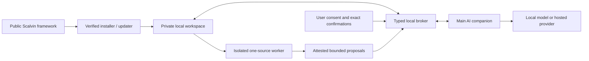

# Scalvin

[](https://github.com/cerncaycisi/scalvin/actions/workflows/ci.yml)
[](https://github.com/cerncaycisi/scalvin/security/advisories/new)
[](LICENSE)

Scalvin is a local-first AI companion framework for self-reflection,
conversation continuity, and user-controlled memory.

> **Development status:** the current `1.0.0` line is an unreleased development
> preview. Independent safety review and release-candidate behavior evaluation
> are not complete; this is not clinical validation.

It combines a natural conversational experience with a deterministic
installer, explicit data consent, multi-client adapters, layered memory,
broker-mediated private workspace access, isolated source processing, safety
evals, and verifiable backup/update tooling. Generated Codex and Claude policy
denies direct private-file access, while the project still reports that static
policy as runtime-unattested rather than claiming a hard sandbox.

Scalvin is not a therapist, clinician, medical device, crisis service, or
substitute for professional care. The supported public project is designed for
adults.

## What makes Scalvin different

Scalvin's architecture is built around:

- separate public framework and private user workspace;
- Codex, Claude Code, and generic client adapters;
- safety and consent loaded before mutable memory;
- profile, themes, current focus, primer, sessions, sources, context, and
  archive with clear ownership;
- item-level provenance and stale-memory review;
- controlled user overlays instead of silent base-prompt self-modification;
- deterministic install, update, doctor, backup, and restore;
- locale-pack mechanical safety backstop with precision/over-fire tests;
- source prompt-injection boundaries;
- explicit inspect, correct, pause, forget, export, transcript, and delete
  controls.

## Data-flow truth



Durable workspace storage is local by default. If the AI client uses a hosted
model, the live message and selected local context may be sent to that
provider. Scalvin does not override provider policy and does not describe
hosted inference as on-device.

Read [Privacy and Data Flow](docs/PRIVACY.md) before using Scalvin with
sensitive material.

## Quick start

Requirements: Git and Node.js 20 or newer.

```bash
git clone https://github.com/cerncaycisi/scalvin.git
cd scalvin
```

Open this source folder in Codex, Claude Code, or another repo-aware agent and
say hello in any language. The default language preference is `auto`.

Conversation capability is not the same as published safety evidence. Scalvin
can respond in any language the active model handles reliably, while the
currently bundled mechanical safety packs and release-evaluation samples cover
only finite English (`en`) and Turkish (`tr`) cases. An unevaluated language is
not represented as safety-equivalent evidence.

Scalvin first explains:

- what local continuity memory stores;
- what a hosted model provider may receive;
- how to inspect, correct, pause, export, forget, or delete data;
- that raw transcripts are a separate opt-in and off by default.

You may continue without saved memory.

For an explicit CLI install:

```bash
node bin/scalvin.js install \
  --workspace "~/scalvin-workspace" \
  --consent not-decided
```

Installation ends the bootstrap session. Next:

1. keep this checkout in place during the development preview;
2. close the source-repository session;
3. open `~/scalvin-workspace` as a new client project;
4. approve the local Scalvin connection if the client asks; and
5. start a fresh session there.

Opening the generated workspace as a new project is required for its client
policy and local tool configuration to take effect. Continuing from the source
repository would bypass those project settings.

Verify from this checkout when needed:

```bash
node bin/scalvin.js doctor \
  --workspace "~/scalvin-workspace"
```

See [Getting Started](docs/GETTING-STARTED.md) for selections, JSON mode,
dry-runs, backups, restores, and updates.

## Default configuration

- companion: Susan;
- persona: Susan;
- structure: moderate;
- active modalities: ACT, CFT, Motivational Interviewing;
- transcripts: off;
- body prompts: ask first;
- between-session experiments: ask first.

Other personas remain available. Advanced modality
references are installed as library material but are not automatically active.
Risk-tier and consent rules still apply after selection.

## User controls

The development preview supports bounded status, memory
inspection/correction/creation, pause/seal, consent, session lifecycle,
prepared-source proposal review/integration, and backup-reminder handling
through its local connection. Source processing runs in a separate ephemeral
Codex or Claude worker with only one assigned-source reader and proposal
submission; the main companion never receives raw source chunks.

The following privacy-sensitive lifecycle controls remain terminal-only:

```text
memory resume after sealed pause; forget/delete/export/review/retention;
transcript controls; context mutations; preferences; backup/restore/update;
behavior changes; source add/process/reject/delete
```

Use `node bin/scalvin.js help` from the retained checkout for those commands.
Memory and transcript consent are separate. A paused interval is not silently
backfilled. A prepared source proposal remains untrusted, requires explicit
candidate-ID selection, and never writes live memory automatically.

## Layered continuity

| Layer | Purpose |
|---|---|
| Profile | Lean durable context and user-confirmed preferences |
| Active themes | Medium-term recurring work |
| Current focus | Immediate working direction |
| Next primer | Short handoff to the next session |
| Sessions | Chronological summaries with provenance |
| Sources | User-provided untrusted documents and integration records |
| Context graph | Opt-in people, places, and events with lifecycle state |
| Archive | Historical/compressed material, opened selectively |
| Overlays | Approved user-specific behavior adjustments with rollback |

Current user statements outrank older model-authored summaries. Import time is
not treated as live confirmation. Users can inspect and correct what the
runtime relies on.

## Personas, structures, and modalities

The libraries provide conversation styles and reflection tools, not clinical
treatment.

- Personas control voice, length, challenge, and presence without fabricated
  human identity.
- Structures range from freeform to structured, while safety, consent, and
  accessibility always take precedence.
- Modalities provide questions and low-risk exercises informed by named
  traditions. Higher-intensity techniques are quarantined or limited to
  psychoeducation/clinician-guided use.

See [Scope and Evidence Boundary](docs/SCOPE-AND-EVIDENCE.md). Independent
clinical and safety review has not been completed; the requirements are
documented in the [Clinical and Safety Review Gate](docs/CLINICAL-SAFETY-REVIEW.md).

## Safety

Scalvin uses two layers:

1. an immutable prose safety protocol;
2. a bounded, locale-pack-driven mechanical hook for supported clients.

The hook scans all installed, validated locale packs; it does not define the
set of languages Scalvin can converse in. It is defense in depth, not complete
detection. CI tracks must-fire, silent-expected, known-boundary, and over-fire
cases per bundled pack. The runtime distinguishes
imminent self-harm, harm to others, abuse/safeguarding, possible
psychosis/medical emergency, and lower-immediacy distress.

Scalvin cannot call emergency services, locate or monitor a user, or guarantee
confidentiality. Current location-aware guidance lives in
[the safety protocol](safety-protocol.md).

## Deterministic lifecycle

```bash
node bin/scalvin.js install --help
node bin/scalvin.js doctor --workspace "<workspace>"
node bin/scalvin.js backup --workspace "<workspace>" --output "<directory>"
node bin/scalvin.js restore --backup "<backup>" --workspace "<workspace>" --dry-run
node bin/scalvin.js changes history --workspace "<workspace>"
node bin/scalvin.js update --workspace "<workspace>" --manifest-sha256 "<exact-manifest-sha256>" --dry-run
node bin/scalvin.js review-due --workspace "<workspace>" --json
```

Lifecycle commands support previews, verify managed files, preserve user data
and local customizations, and roll back failed mutations. Destructive changes
require the exact confirmation returned by a fresh preview.

Backups are integrity-checked and encrypted by default. Without a custom
passphrase file, Scalvin creates a separate private recovery-key file:

```bash
node bin/scalvin.js backup --workspace "<workspace>" --output "<directory>"
node bin/scalvin.js restore --backup "<backup>" --workspace "<workspace>" \
  --passphrase-file "<generated-recovery-key-file>" --dry-run
```

To supply your own high-entropy passphrase file instead:

```bash
node bin/scalvin.js backup --workspace "<workspace>" --output "<directory>" \
  --passphrase-file "<private-passphrase-file>"
node bin/scalvin.js restore --backup "<backup>" --workspace "<workspace>" \
  --passphrase-file "<private-passphrase-file>" --dry-run
```

The key/passphrase is read from a private file, never from a command argument
or environment value. Keep it separately from the backup; losing it makes the
backup unrecoverable. See
[Getting Started](docs/GETTING-STARTED.md#backup-and-restore) for update,
backup, restore, and recovery details.

## Development

```bash
npm run check
npm test
```

`npm test` includes the evaluator suite. Use `npm run test:evals` only for a
focused evaluator run while developing those rules.

The test suite covers CLI transactions, path/symlink attacks, manifest hashes,
customized-file preservation, legacy migration, backup/restore, safety
precision/recall boundaries, public-repo hygiene, and documentation links.

Contributors must use synthetic data. Never commit a real profile, session,
transcript, source, local path, or credential. See [Contributing](CONTRIBUTING.md)
and [Security](SECURITY.md).

## Documentation

### Using Scalvin

- [Getting Started](docs/GETTING-STARTED.md)
- [Privacy and Data Flow](docs/PRIVACY.md)
- [Client Adapters](docs/CLIENTS.md)
- [Scope and Evidence Boundary](docs/SCOPE-AND-EVIDENCE.md)
- [Localization](docs/LOCALIZATION.md)
- [Accessibility](docs/ACCESSIBILITY.md)
- [Migration](MIGRATING.md)
- [Support](SUPPORT.md)

### Contributors and maintainers

- [Architecture](docs/ARCHITECTURE.md)
- [Engineering Experiment Log](docs/ENGINEERING-EXPERIMENT-LOG.md)
- [Contributing](CONTRIBUTING.md)
- [Clinical and Safety Review Gate](docs/CLINICAL-SAFETY-REVIEW.md)
- [Stable Release Evidence](docs/RELEASE-EVIDENCE.md)
- [Release Process](RELEASING.md)
- [Governance](GOVERNANCE.md)

## Attribution

Scalvin is an independent derivative of Anthony Taglianetti's
[Inner Dialogue](https://github.com/ataglianetti/inner-dialogue). The original
MIT copyright notice is preserved. See [Notices](NOTICE.md).

## License

[MIT](LICENSE)
